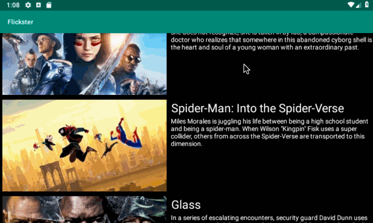

# Flicker
This project lets users view a list of movies sourced from the The Movie Database API.

## User Stories

The following **required** functionality is completed:

* [x] Networking and Parsing JSON
* [x] RecyclerView implementation

## Stretch Stories 

* [x] In portrait mode, the poster image, title, and movie overview is shown.
* [x] In landscape mode, the rotated alternate layout should use the backdrop image instead and show the title and movie    overview to the right of it.
* [x] Display a nice default placeholder graphic for each image during loading 
* [x] mprove the user interface through styling and coloring
* [ ] For popular movies (i.e. a movie voted for more than 5 stars), the full backdrop image is displayed. Otherwise, a poster image, the movie title, and overview is listed

## Video Walkthrough: 

## Portrait Mode
  

## Landscape Mode
  

GIF created with [LiceCap](http://www.cockos.com/licecap/).
